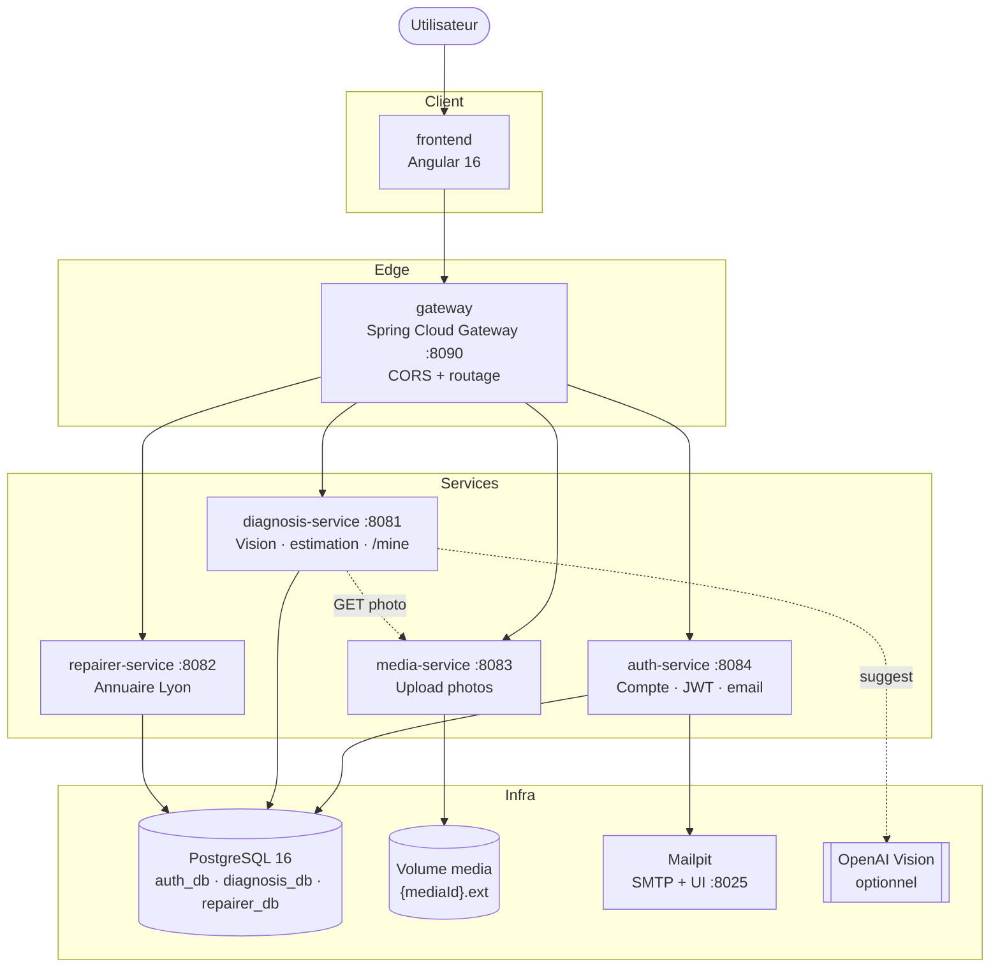
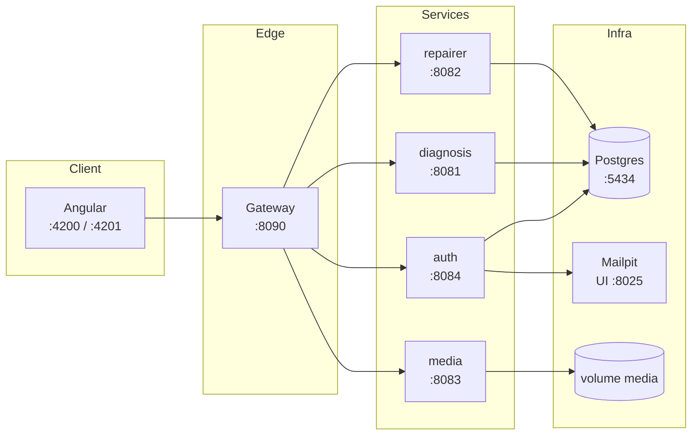
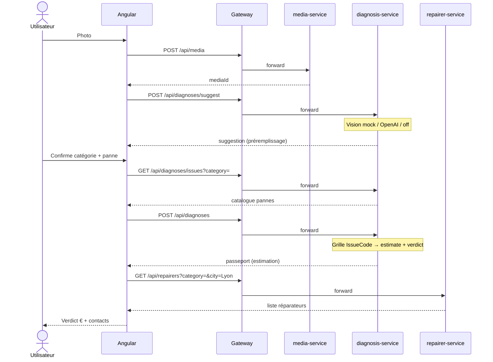
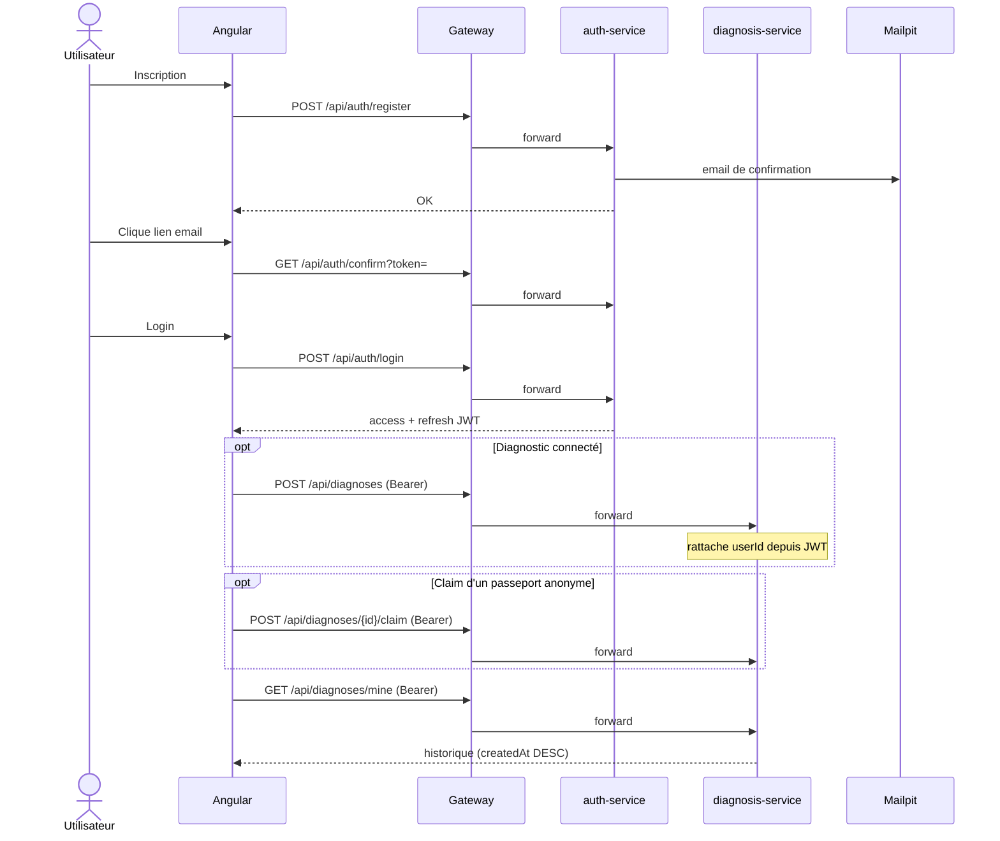
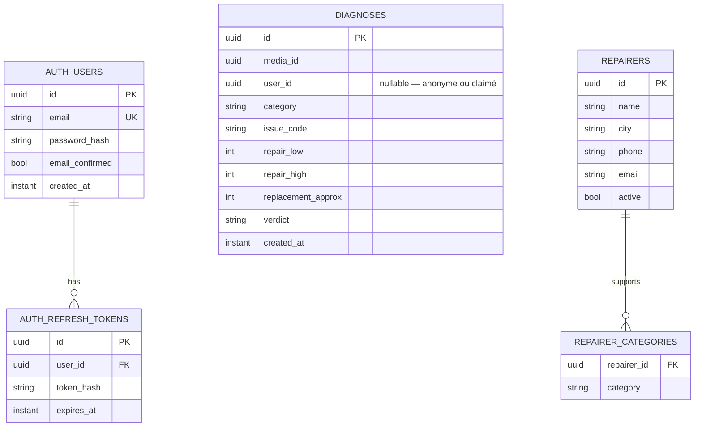

# Passeport de réparation

MVP d’aide à la décision quand un appareil électroménager tombe en panne : une photo suffit pour savoir si ça vaut le coup de réparer, et où contacter un réparateur local.

**Slogan :** *Répare d’abord. Achète ensuite.*

## Problème

Un objet casse. On ne sait ni si la réparation est rentable, ni où aller. Par défaut, on jette et on rachète.

## Concept

En ~30 secondes, à partir d’une photo :

1. **Suggestion + confirmation** — catégorie et panne (IA optionnelle, confirmation manuelle obligatoire)
2. **Estimation réparer vs remplacer** — fourchette de prix pour déclencher la décision
3. **Annuaire local** — réparateurs à proximité, contact en un clic
4. **Compte optionnel** — historique des passeports pour y revenir plus tard

## Fonctionnalités MVP

### 1. Photo + suggestion IA + confirmation appareil / panne

- Import d’une photo de l’appareil
- Suggestion IA de catégorie / panne (préremplissage, non bloquant)
- Confirmation manuelle obligatoire (lave-linge, lave-vaisselle, four, autre)
- Sélection / correction du type de panne pour affiner l’estimation
- Hors périmètre → message explicite, sans estimation trompeuse

### 2. Estimation réparer vs remplacer

- Fourchette de coût de réparation selon le type de panne
- Ordre de grandeur du remplacement
- Verdict simple : **réparer** / **à arbitrer** / **remplacer**
- Disclaimer : estimation indicative, pas un devis

### 3. Annuaire de réparateurs locaux

- Liste curatée manuellement (zone géographique test : Lyon)
- Filtrage par famille d’appareil
- Contact en un clic (téléphone / email / WhatsApp)
- Pas de marketplace, pas de réservation intégrée, pas de paiement

### 4. Compte utilisateur (optionnel)

- Inscription email + mot de passe, confirmation par email
- Connexion / déconnexion, profil éditable
- Mot de passe oublié / réinitialisation
- Historique **Mes passeports** (diagnostics rattachés au compte)
- Parcours anonyme **toujours possible** — le compte n’est jamais obligatoire

## User stories

Documentation PO / architecture / QA :

- [`docs/02-architecture.md`](docs/02-architecture.md)
- [`docs/03-user-stories.md`](docs/03-user-stories.md)
- [`docs/04-plan-de-test.md`](docs/04-plan-de-test.md)
- [`docs/05-ai-vision-branch.md`](docs/05-ai-vision-branch.md) — suggestion IA derrière confirmation
- [`docs/06-compte-utilisateur.md`](docs/06-compte-utilisateur.md) — compte optionnel + historique
- [`docs/07-roadmap-v1.2.md`](docs/07-roadmap-v1.2.md) — roadmap v1.2 (stories US-12 → US-22)
- [`product/user-stories-mvp.json`](product/user-stories-mvp.json)
- [`product/user-stories-mvp.csv`](product/user-stories-mvp.csv)
- [`product/user-stories-v1.2.json`](product/user-stories-v1.2.json)
- [`product/test-matrix.json`](product/test-matrix.json)

### Tests

```bash
# Unitaires
mvn -pl services/auth-service,services/diagnosis-service,services/media-service,services/repairer-service -am test

# Unitaires Angular
cd frontend && npm run test:ci

# E2E (stack Docker requise sur :8090 + Mailpit :8025)
docker compose up -d
mvn -pl e2e-tests -Pe2e test -De2e.base.url=http://localhost:8090 -De2e.mailpit.url=http://localhost:8025
```

Plan QA : [`docs/04-plan-de-test.md`](docs/04-plan-de-test.md) · matrice : [`product/test-matrix.json`](product/test-matrix.json)

## Parcours utilisateur

```
Photo → Suggestion IA → Confirmation → Verdict € → Réparateurs
         ↘ (optionnel) Compte → Mes passeports
```

Diagrammes (conteneurs, séquences, données) : [Architecture](#architecture).

## Hors scope (v1)

- Compte utilisateur **obligatoire**
- OAuth (Google / Apple)
- Marketplace / matching temps réel
- Devis en ligne et paiement
- Suivi de réparation
- Tutoriels DIY
- Couverture de toutes les catégories d’appareils

## Décisions techniques & produit

Ces choix ont été **arbitrés manuellement** (périmètre MVP, trade-offs, cohérence du monorepo) — l’IA a servi d’accélérateur d’implémentation, pas de décideur.

### Architecture

| Décision | Choix retenu | Pourquoi / alternative écartée |
|----------|--------------|--------------------------------|
| Style applicatif | **Microservices** Maven + gateway | Séparation claire des bounded contexts ; monolithe reporté |
| Orchestration | **Frontend** (upload → suggest → diagnose → repairers) | Simple pour un MVP ; pas de BFF / saga |
| Entrée API | **Spring Cloud Gateway** (:8090) | CORS + routage unique ; le front ne parle qu’à la gateway |
| Données | **1 Postgres DB par service** | Database-per-service ; pas de DB partagée |
| Infra locale | **Docker Compose**, URLs fixes | Pas d’Eureka / Kafka en v1 |
| Ports locaux | Gateway **8090**, Postgres **5434** | Éviter les conflits avec d’autres projets locaux |

### Diagnostic & vision

| Décision | Choix retenu | Pourquoi / alternative écartée |
|----------|--------------|--------------------------------|
| Source de vérité | **Confirmation utilisateur** (catégorie + panne) | Évite une estimation trompeuse si l’IA se trompe |
| Vision IA | **Suggestion seulement** (`/suggest`), derrière confirmation | Préremplit l’UI ; jamais le verdict final |
| Providers vision | `mock` (défaut) · `openai` · `off` | Mock sans clé pour itérer ; OpenAI optionnel |
| Pricing | **Grille `IssueCode`** + règle 70 % mid-repair | Pas de prix aléatoire / mock vision |

### Compte utilisateur

| Décision | Choix retenu | Pourquoi / alternative écartée |
|----------|--------------|--------------------------------|
| Obligation du compte | **Optionnel** | Ne pas freiner le parcours « 30 secondes » |
| Contenu du compte | **Profil + historique** des passeports | Revenir / retrouver ses diagnostics |
| Email dès v1 | **Confirm inscription + reset mdp** | Compte crédible sans reporter la confiance |
| Auth | **`auth-service` maison** (JWT + refresh + BCrypt) | Cohérent avec le monorepo Spring ; Keycloak / Auth0 trop lourds pour ce MVP |
| OAuth | **Reporté** | Hors périmètre v1 |

Détail cadrage : [`docs/02-architecture.md`](docs/02-architecture.md), [`docs/05-ai-vision-branch.md`](docs/05-ai-vision-branch.md), [`docs/06-compte-utilisateur.md`](docs/06-compte-utilisateur.md).

## Architecture

Vue synthétique pour onboarding et revue. Détail : [`docs/02-architecture.md`](docs/02-architecture.md).

### Principes

- **Microservices synchrones** + **gateway** unique — le front ne parle qu’à `:8090`
- **Orchestration côté Angular** (upload → suggest → diagnose → repairers) — pas de BFF / saga
- **Database-per-service** (Postgres) — pas de DB partagée
- **Compte optionnel** — JWT partagé auth ↔ diagnosis pour `/mine` et claim
- **Vision IA = suggestion** — la confirmation utilisateur reste la source de vérité

### Vue conteneurs



### Déploiement local



### Séquence — parcours anonyme (cœur MVP)



### Séquence — compte optionnel & historique



### Modèle de données (simplifié)



> **media** : pas de table — fichiers `{mediaId}.{ext}` sur volume.  
> **auth_db** / **diagnosis_db** / **repairer_db** : bases distinctes sur le même Postgres.

### Composants Maven

```
passeport-reparation/
├── common/                 # DTOs / enums partagés
├── services/
│   ├── gateway/            # :8090 — CORS + routes
│   ├── auth-service/       # :8084 — compte, JWT, mail
│   ├── diagnosis-service/  # :8081 — vision, estimation, /mine
│   ├── repairer-service/   # :8082 — annuaire
│   └── media-service/      # :8083 — photos
├── frontend/               # Angular 16
├── e2e-tests/              # JUnit via gateway + Mailpit
├── infra/postgres/         # init auth_db, diagnosis_db, repairer_db
├── product/                # stories, Postman, matrice QA
└── docker-compose.yml
```

### Microservices

| Service | Port | Responsabilité |
|---------|------|----------------|
| **gateway** | 8090 | Entrée unique, routage, CORS |
| **diagnosis-service** | 8081 | Suggestion vision + confirmation + estimation + historique `/mine` |
| **repairer-service** | 8082 | Annuaire curaté, filtre catégorie / zone |
| **media-service** | 8083 | Upload / stockage local des photos |
| **auth-service** | 8084 | Compte, JWT, confirm email, reset mdp |
| **frontend** | 4200 (dev) / 4201 (Docker) | SPA Angular |

### Stack

| Couche | Techno |
|--------|--------|
| Frontend | Angular 16 |
| Backend | Java 21, Spring Boot 3.3, Maven |
| Auth | Spring Security, JWT + refresh, BCrypt |
| Email | SMTP / Mailpit (local, UI :8025) |
| Base de données | PostgreSQL 16 (DB par service) |
| Conteneurs | Docker / Docker Compose |
| Architecture | Microservices |

**Infra locale :** Compose + URLs fixes (pas d’Eureka / Kafka).
## Démarrage rapide

### Prérequis

- Java 21, Maven 3.9+
- Node 18+, Angular CLI 16
- Docker (optionnel mais recommandé pour Postgres + Mailpit)

### 1. Variables d’environnement

Copier [`.env.example`](.env.example) vers `.env` si besoin (`JWT_SECRET`, vision, mail).

### 2. Base de données

```bash
docker compose up -d postgres mailhog
# Postgres :5434 · Mailpit UI : http://localhost:8025 · SMTP :1025
# (service Compose nommé mailhog, image Mailpit)
```

Si le volume Postgres existait **avant** `auth_db` :

```bash
docker compose exec postgres psql -U passeport -c "CREATE DATABASE auth_db;"
```

### 3. Backend

```bash
export JAVA_HOME=$(/usr/libexec/java_home -v 21 2>/dev/null || echo "/Library/Java/JavaVirtualMachines/temurin-21.jdk/Contents/Home")
mvn -pl services/auth-service,services/media-service,services/diagnosis-service,services/repairer-service,services/gateway -am spring-boot:run
```

Ou lancer chaque service dans un terminal :

```bash
mvn -pl services/auth-service -am spring-boot:run
mvn -pl services/media-service -am spring-boot:run
mvn -pl services/diagnosis-service -am spring-boot:run
mvn -pl services/repairer-service -am spring-boot:run
mvn -pl services/gateway -am spring-boot:run
```

API via gateway : `http://localhost:8090`

### 4. Frontend

```bash
cd frontend && npm install && npm start
```

App : `http://localhost:4200`

### Tout en Docker

```bash
docker compose up --build
```

- Frontend : http://localhost:4201  
- API : http://localhost:8090  
- Mailpit : http://localhost:8025  

## API (via gateway)

| Méthode | Chemin | Description | Auth |
|---------|--------|-------------|------|
| `POST` | `/api/auth/register` | Créer un compte | public |
| `GET` | `/api/auth/confirm?token=` | Confirmer l’email | public |
| `POST` | `/api/auth/login` | Connexion → JWT + refresh | public |
| `POST` | `/api/auth/refresh` | Renouveler les tokens | refresh |
| `POST` | `/api/auth/logout` | Révoquer le refresh | public |
| `POST` | `/api/auth/forgot-password` | Demander un reset | public |
| `POST` | `/api/auth/reset-password` | Nouveau mot de passe | public |
| `GET` | `/api/auth/me` | Profil | Bearer |
| `PATCH` | `/api/auth/me` | Modifier le profil | Bearer |
| `POST` | `/api/media` | Upload photo (`multipart`, champ `file`) | public |
| `GET` | `/api/media/{id}` | Télécharger la photo | public |
| `POST` | `/api/diagnoses/suggest` | Suggestion IA | public |
| `GET` | `/api/diagnoses/issues?category=OVEN` | Catalogue pannes | public |
| `POST` | `/api/diagnoses` | Estimation (rattache `userId` si JWT) | public / Bearer |
| `GET` | `/api/diagnoses/mine` | Historique de l’utilisateur | Bearer |
| `POST` | `/api/diagnoses/{id}/claim` | Rattacher un passeport anonyme au compte | Bearer |
| `GET` | `/api/diagnoses/{id}` | Relire un diagnostic | public |
| `GET` | `/api/repairers?category=&city=Lyon` | Annuaire | public |

Le diagnostic s’appuie sur la **confirmation utilisateur** (catégorie + panne) et une grille de prix. La suggestion IA (`/suggest`) préremplit l’UI mais n’est jamais la source de vérité.

### Vision IA (optionnelle)

| `VISION_PROVIDER` | Comportement |
|-------------------|--------------|
| `mock` (défaut) | Suggestion locale sans clé API |
| `openai` | OpenAI Vision (`OPENAI_API_KEY` requis) |
| `off` | Pas de suggestion — choix 100 % manuel |

### Compte & email

| Variable | Rôle |
|----------|------|
| `JWT_SECRET` | Secret partagé auth + diagnosis (min. 32 caractères) |
| `MAIL_ENABLED` | `true` en Docker (Mailpit) · `false` → liens loggés |
| `APP_FRONTEND_URL` | Base des liens email (confirm / reset) |

Voir [`.env.example`](.env.example), [`docs/05-ai-vision-branch.md`](docs/05-ai-vision-branch.md) et [`docs/06-compte-utilisateur.md`](docs/06-compte-utilisateur.md).

### Pages front utiles

| Route | Rôle |
|-------|------|
| `/` | Parcours photo / confirmation |
| `/inscription` | Créer un compte |
| `/connexion` | Se connecter |
| `/mot-de-passe-oublie` | Demander un reset |
| `/confirmer-email` | Lien reçu par email |
| `/compte` | Profil |
| `/mes-passeports` | Historique |

### Collection Postman

Importer dans Postman :

- [`product/postman/Passeport-Reparation-MVP.postman_collection.json`](product/postman/Passeport-Reparation-MVP.postman_collection.json)
- Image d’exemple : [`product/postman/sample.png`](product/postman/sample.png)

Variable `baseUrl` = `http://localhost:8090`. Pour l’upload, sélectionner `sample.png` (ou une autre image) dans le champ `file`.

## Roadmap indicative

| Version | Contenu |
|---------|---------|
| **MVP** | Photo → suggestion + confirmation → estimation → annuaire |
| **v1.1** | Compte optionnel, confirm email, historique Mes passeports |
| **v1.2** | Continuité compte, confiance métier, session, vision calibrée — voir [`docs/07-roadmap-v1.2.md`](docs/07-roadmap-v1.2.md) |
| **v2** | OAuth, suivi réparation, partenariats renforcés |

### v1.2 — vagues (résumé)

| Vague | Focus | Stories |
|-------|--------|---------|
| **A** | Continuité compte (claim anonyme, liste enrichie) | US-12, US-13 |
| **B** | Confiance métier (prix, annuaire) | US-14, US-15 |
| **C** | Session & sécu (refresh, rate-limit) | US-16, US-17 |
| **D** | Vision calibrée (seuil confiance, fixtures) | US-18, US-19 |
| **E** | Clarté & qualité (verdict, docs, E2E auth) | US-20 → US-22 |

## 🤖 Note sur l'utilisation de l'IA

J'utilise Cursor comme accélérateur de développement, au même titre que Copilot
ou un bon IDE — pour le boilerplate et l'itération rapide. La conception (choix
d'architecture, arbitrages techniques, logique métier) reste un travail manuel :
c'est ce qui distingue un MVP fonctionnel d'un simple prototype généré.

## Licence

À définir.
