# Tutoriel MVP — Passeport de réparation

Guide pas à pas du parcours utilisateur, avec captures d’écran prises sur l’environnement local (`http://localhost:4200`).

**Slogan :** *Répare d’abord. Achète ensuite.*

## Prérequis

```bash
# À la racine du repo
docker compose up -d
# Puis le front en dev
cd frontend && npm start
```

| Service | URL |
|---------|-----|
| Application | http://localhost:4200 |
| API (gateway) | http://localhost:8090 |
| Mailpit (emails de test) | http://localhost:8025 |

> En local, les emails **n’arrivent pas dans Gmail** : ouvre Mailpit.

---

## 1. Accueil — démarrer avec une photo

Ouvre http://localhost:4200/

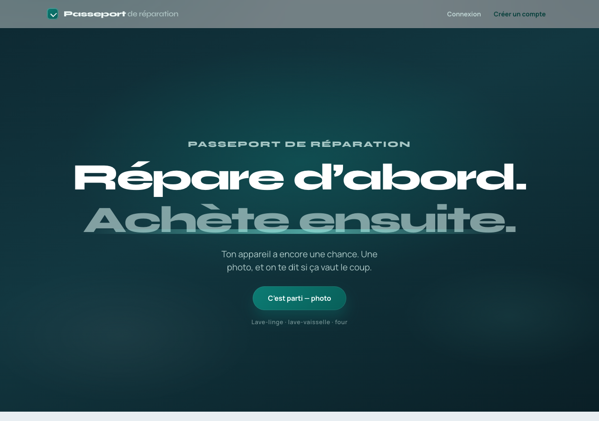

1. Clique sur **C’est parti — photo**
2. Choisis une image (JPEG / PNG / WebP), par ex. `product/postman/sample.png`

L’app envoie la photo au `media-service`, puis demande une **suggestion IA** (mock ou OpenAI selon `VISION_PROVIDER`).

---

## 2. Confirmer l’appareil et la panne

Après l’upload, l’écran de confirmation s’affiche.

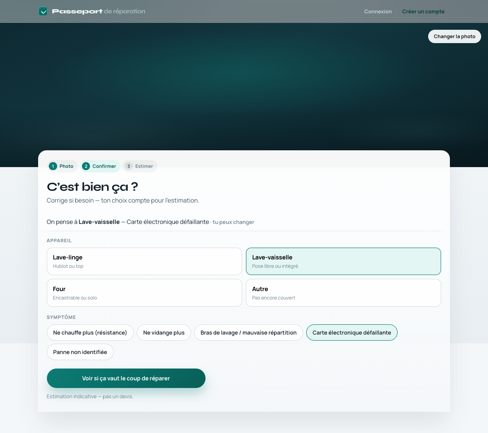

- La suggestion IA préremplit catégorie / panne (**tu peux tout corriger**)
- Choisis l’**appareil** (lave-linge, lave-vaisselle, four, ou autre)
- Choisis le **symptôme** dans la liste

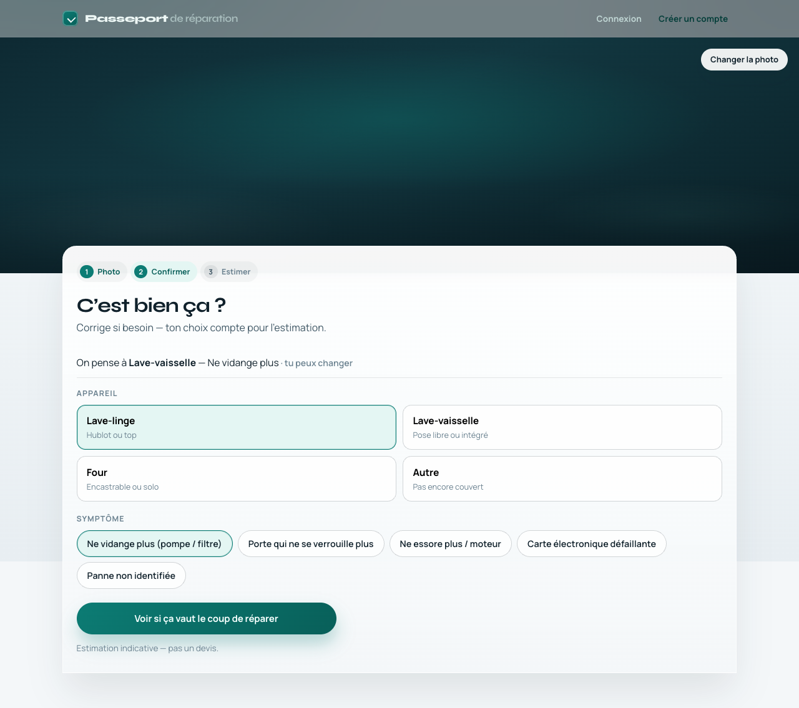

Puis clique sur **Voir si ça vaut le coup de réparer**.

> La confirmation utilisateur est la **source de vérité** — pas la suggestion IA.

---

## 3. Résultat — estimation et réparateurs

Tu arrives sur `/resultat` :

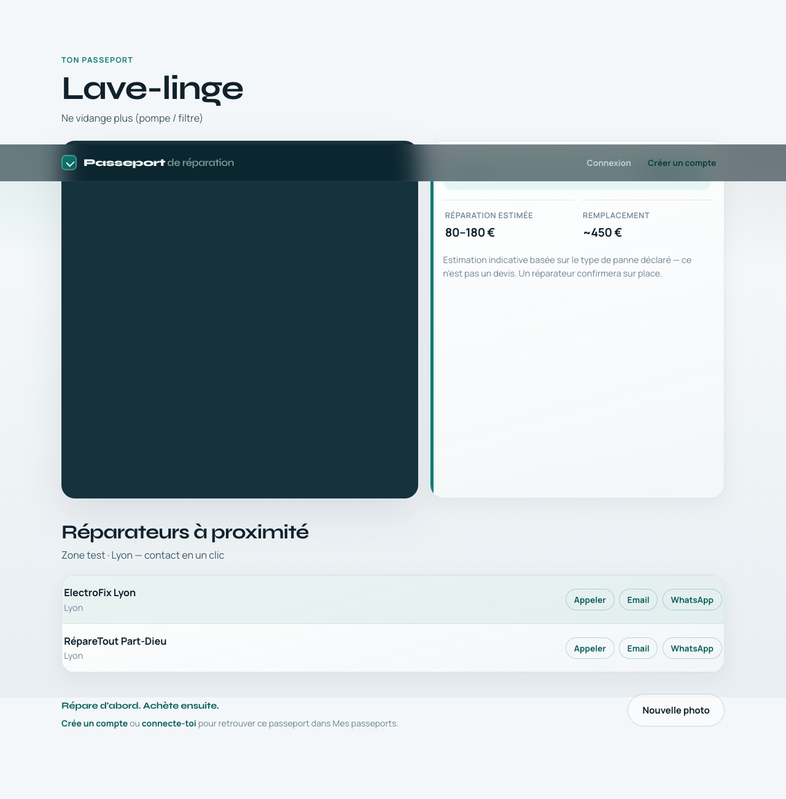

Tu y trouves :

1. **Fourchette de réparation** vs **ordre de grandeur du remplacement**
2. Un **verdict** indicatif (réparer / à arbitrer / remplacer)
3. Une liste de **réparateurs** (zone test : Lyon) avec Appeler / Email / WhatsApp
4. Un rappel : le compte est **optionnel** pour sauvegarder ce passeport

Le disclaimer *« Estimation indicative — pas un devis »* est volontaire.

---

## 4. Créer un compte (optionnel)

Menu **Créer un compte** → `/inscription`

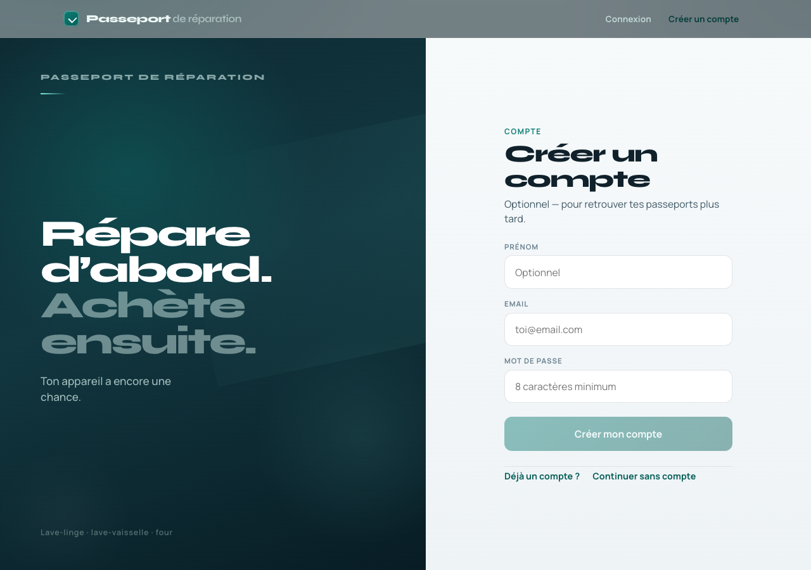

1. Renseigne email + mot de passe (≥ 8 caractères)
2. Valide → message de succès

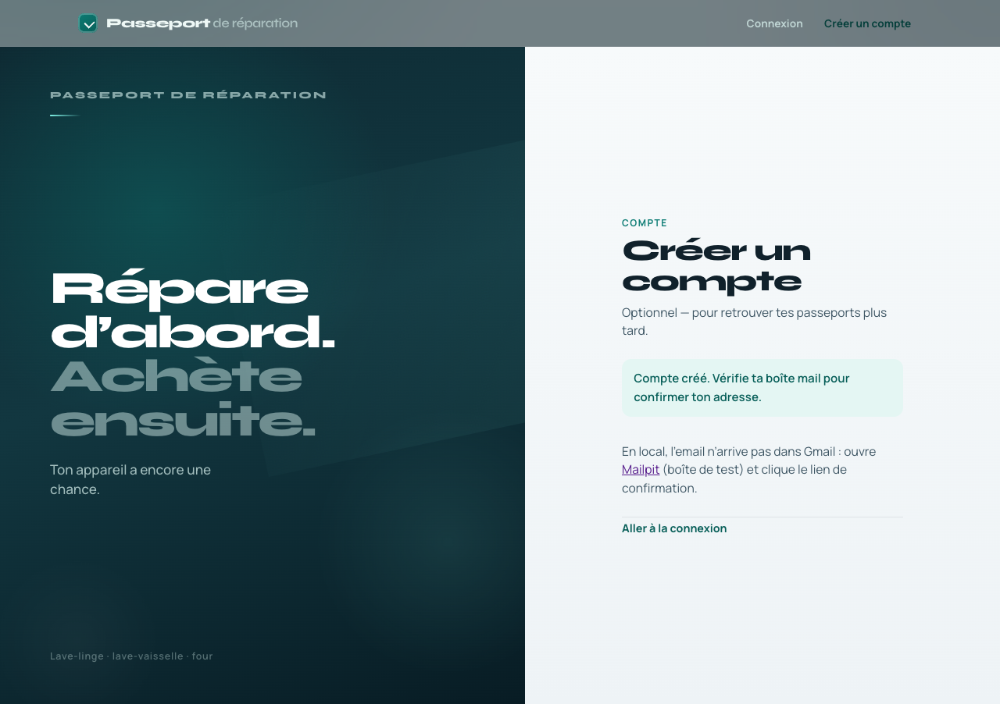

---

## 5. Confirmer l’email via Mailpit

Ouvre http://localhost:8025

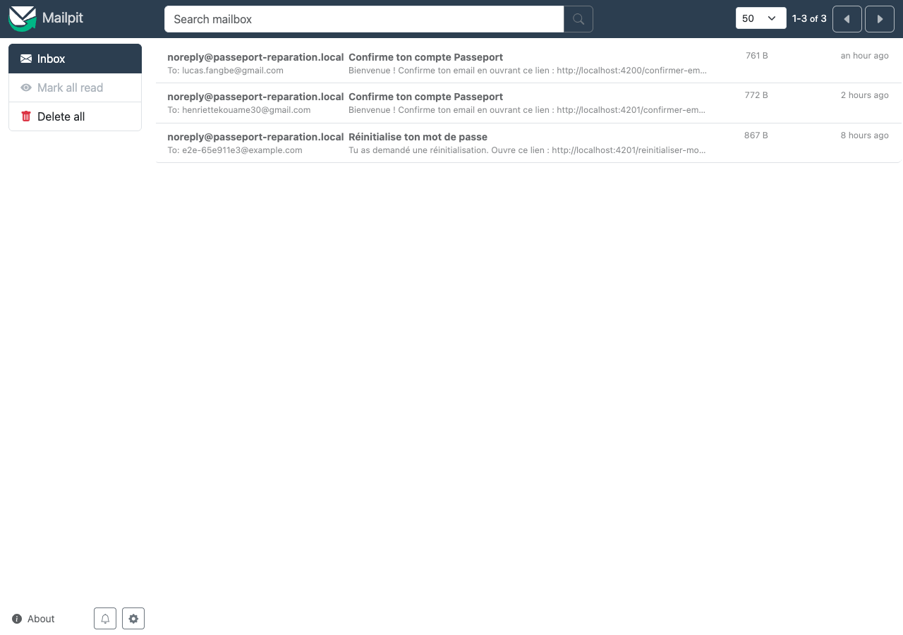

1. Ouvre le mail **Confirme ton compte Passeport**
2. Clique le lien (ou copie l’URL `/confirmer-email?token=…`)
3. Tu peux ensuite te connecter

Sans confirmation, le login affiche : *« Confirme ton email avant de te connecter. »*

---

## 6. Se connecter

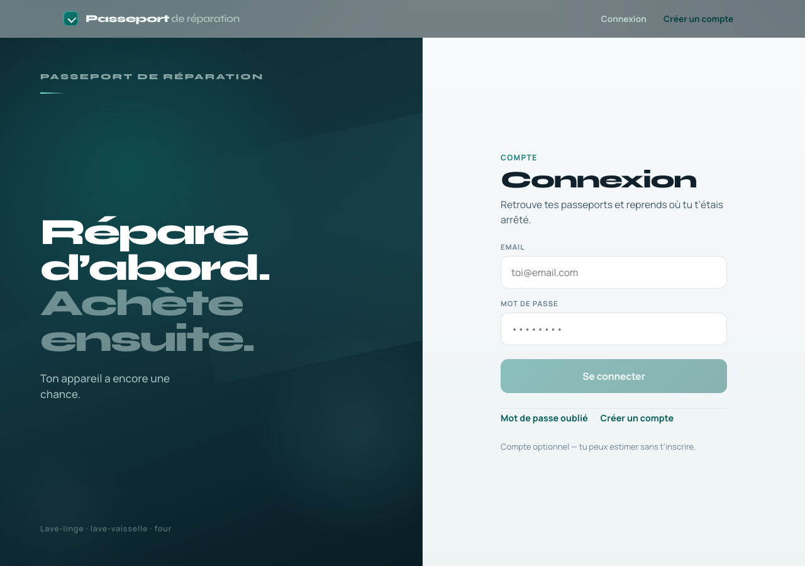

Après login : accès à **Compte** et **Mes passeports**.

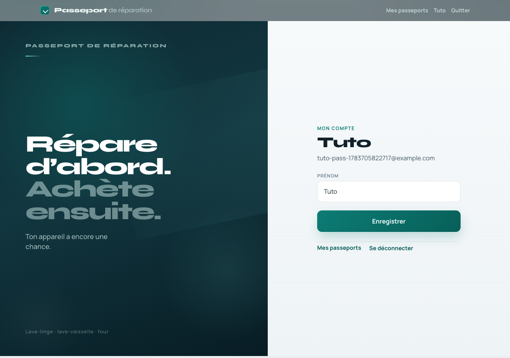

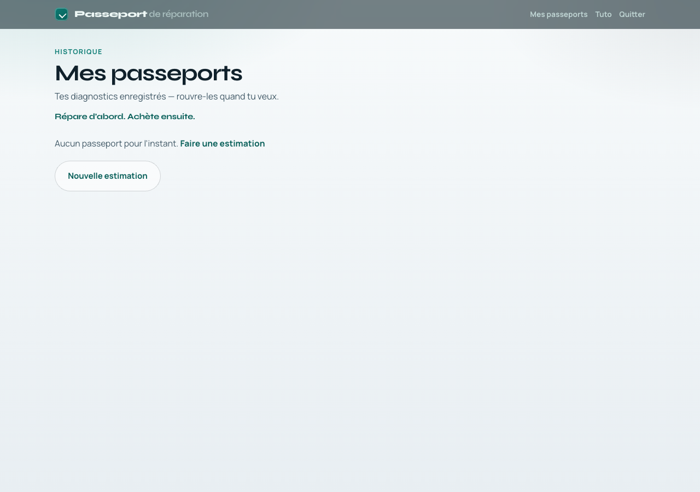

- Les diagnostics faits **connecté** apparaissent ici (date, appareil, verdict)
- Un diagnostic **anonyme** peut être rattaché via le claim (si un `diagnosisId` est encore en session)

---

## 7. Mot de passe oublié

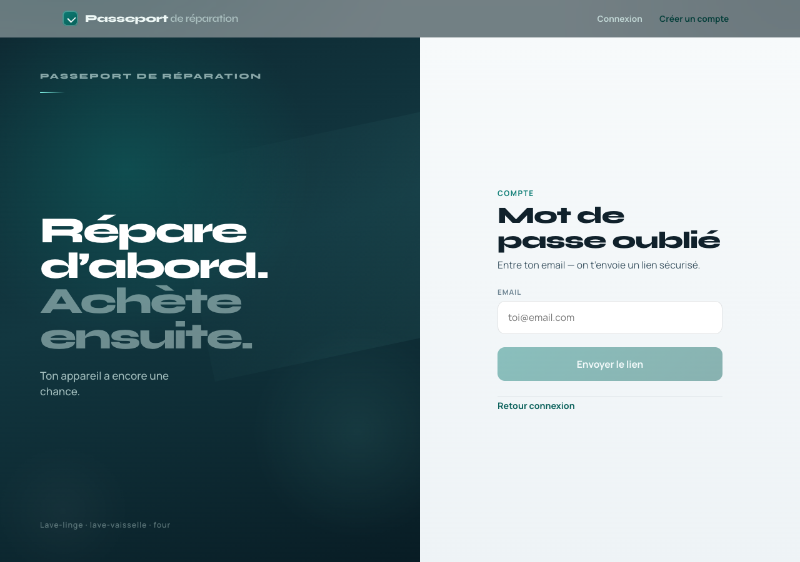

1. Saisis ton email
2. Ouvre le mail dans **Mailpit**
3. Suis le lien `/reinitialiser-mot-de-passe?token=…`

Astuce : le reset peut aussi débloquer un compte jamais confirmé (le flux marque l’email comme vérifié).

---

## Parcours résumé

```
Accueil → Photo → Suggestion IA → Confirmation → Résultat € + réparateurs
                ↘ Inscription → Mailpit → Confirm → Connexion → Mes passeports
```

## Dépannage rapide

| Problème | Piste |
|----------|--------|
| Pas de mail | Mailpit `:8025` (pas Gmail) |
| « Compte déjà existant » | Première inscription OK en base — confirme via Mailpit ou « Mot de passe oublié » |
| API indisponible | `docker compose up -d` + gateway `:8090` |
| Pas de suggestion | Normal si `VISION_PROVIDER=off` — choisis manuellement |

## Pour aller plus loin

- Architecture : [`02-architecture.md`](02-architecture.md) · README section Architecture
- Compte : [`06-compte-utilisateur.md`](06-compte-utilisateur.md)
- Vision IA : [`05-ai-vision-branch.md`](05-ai-vision-branch.md)
- Env de test : [`08-environnement-test.md`](08-environnement-test.md)
